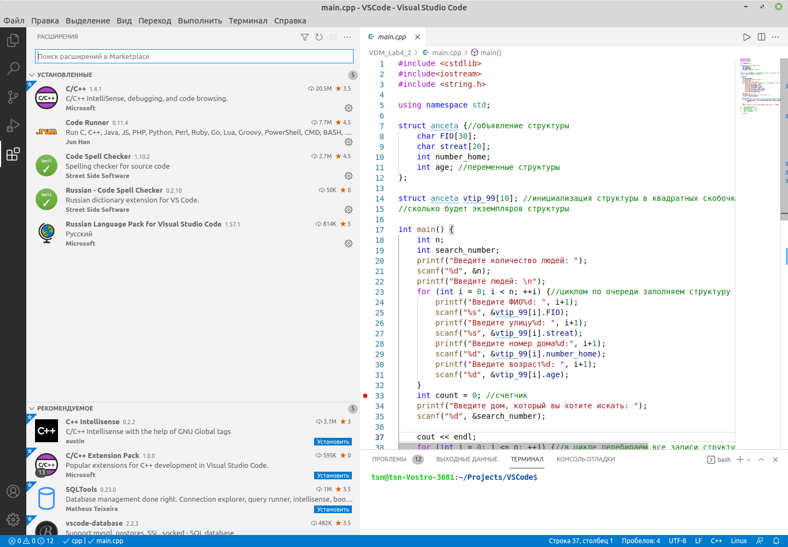
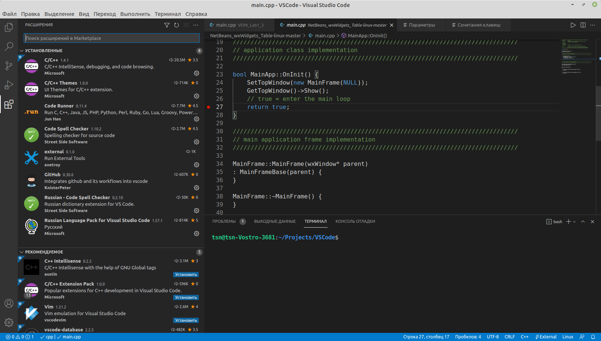

# VSCode_for_CPP_Linux

VSCode для C++ в Linux Mint 20 (с поддержкой wxWidgets)

***Приведенные настройки позволяют собирать, запускать и отлаживать программы из нескольких файлов, а также с использованием визуальных компонент wxWidgets***

Посмотреть видео об этом: https://youtu.be/-5DMNgMT5x0
